# Claude Code Cost Sidebar

**A live cost and usage panel for Claude Code.**

**Install.** Paste this into a terminal on a Mac:

```bash
D="$HOME/claude-code-cost-sidebar"
if [ -d "$D/.git" ]; then git -C "$D" pull --ff-only; else git clone https://github.com/andrewbakercloudscale/claude-code-cost-sidebar.git "$D"; fi \
  && bash "$D/claude-panel-setup.sh"
```

Then start a new Claude Code session and the sidebar opens by itself. It needs Claude Code 2.1.287 or later, `git`, `jq` and Node.js ([Requirements](#requirements)). Keep the `~/claude-code-cost-sidebar` folder: the sidebar is installed from it. Pasting the same lines again updates it.

**Uninstall.** One paste removes everything setup installed, then the folder:

```bash
curl -fsSL https://raw.githubusercontent.com/andrewbakercloudscale/claude-code-cost-sidebar/main/claude-panel-uninstall.sh | bash \
  && rm -rf "$HOME/claude-code-cost-sidebar"
```

What it removes, and a dry run that only lists it, are under [Uninstall](#uninstall).

Live, always-visible cost and token tracking for **[Claude Code](https://claude.com/claude-code)**, as a **mod**: a sidebar Claude Code itself draws beside the transcript, so you can watch what a coding agent is actually costing you, turn by turn, instead of finding out at the end of the month.

<table>
<tr>
<td valign="top">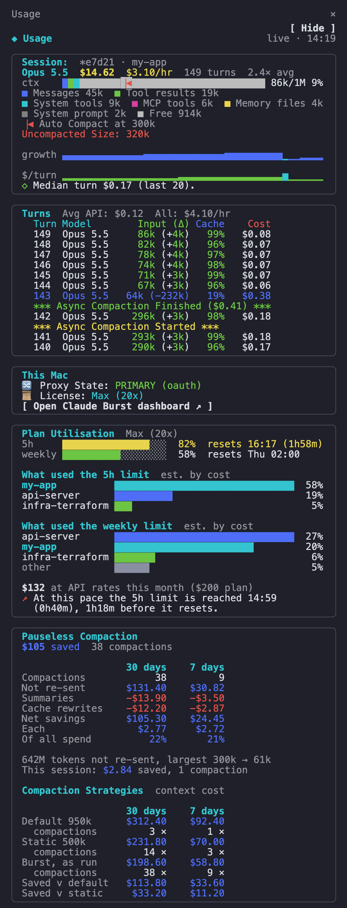</td>
<td valign="top">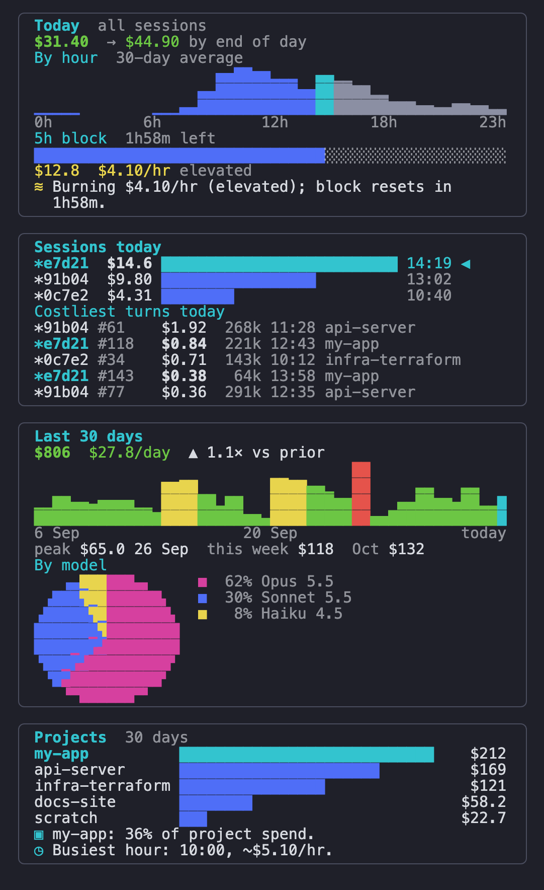</td>
</tr>
<tr>
<td align="center"><sub>What a session opens with</sub></td>
<td align="center"><sub>Scrolled down</sub></td>
</tr>
</table>

<sub>Every figure in the screenshots is made up. They are drawn by the mod's own code from invented numbers (`docs/render-screenshots.mjs`); the whole sidebar in one picture is [`docs/usage-sidebar.png`](docs/usage-sidebar.png).</sub>

This came out of a simple problem: AI coding agents burn tokens and money per turn, per session, per day, and none of that is visible while you're working. You only find out later, from a dashboard or an invoice, by which point the expensive session is long over and you've learned nothing you can act on. This repo is the fix: a live panel that sits next to your session and updates every few seconds.

> **Companion tool: [Claude Burst](https://github.com/andrewbakercloudscale/claude-burst).** A local gateway for Claude Code (subscription-first routing with failover, pauseless compaction, session coordination, a dashboard). Each works without the other. Together, the sidebar shows the context Burst really sends, how much of your plan's 5-hour and weekly limits is used (with a warning as one gets close), and marks every pauseless compaction as it happens: see [Pauseless compaction](#pauseless-compaction-with-claude-burst).

The same panel for OpenCode lives in **[opencode-cost-usage-panel](https://github.com/andrewbakercloudscale/opencode-cost-usage-panel)**: the two were one repo until they were split apart, which is why the design notes here and there cross-reference each other.

Full write-up and motivation: **[AI coding costs are guesswork without this: instrumenting OpenCode and Claude Code](https://andrewbaker.ninja/2026/08/22/ai-coding-costs-are-guesswork-without-this-instrumenting-opencode-and-claude-code/)**

## What you get

### The sidebar: a Claude Code mod (2.1.287 and later)

A mod is a Claude Code plugin that draws inside the session. On a Claude Code that loads mods, setup installs the **usage-panel mod** (`mods/usage-panel`), and every new session opens the panel as a sidebar docked to the right of the transcript. Nothing is typed into your terminal, no Accessibility permission is needed and it works in any terminal: Claude Code draws it. Before the mod, the panel was a Ghostty split that a launcher opened by typing keystrokes; that split is still here for older versions (see [The panel](#the-panel)).

Each section is its own card, most specific first: this session, its turns, this Mac, Plan Utilisation, Pauseless Compaction (with Claude Burst), today across your sessions, sessions today, the last 30 days, your projects. The sidebar scrolls, so the lower cards are a scroll away, and each can be hidden or moved. [Reading the sidebar](#reading-the-sidebar) goes through every card.

| Command | |
|---|---|
| `/show-cost-panel` | Show the sidebar in this session, beside the transcript. |
| `/hide-cost-panel` | Hide it in this session. New sessions still open it; `/usage-panel unpin` stops that. |
| `/usage-panel` | Open the sidebar (or focus it). Esc puts you back in the prompt. |
| `/usage-panel unpin` | Stop it opening by itself in new sessions. |
| `/usage-panel pin` | Open it in every new session again (the default). |
| `/usage-panel hide <section>` / `show <section>` | Hide a section, or bring it back. Sections: `session`, `turns`, `mac`, `plan`, `savings`, `today`, `sessions`, `days`, `projects`. |
| `/usage-panel up` / `down` / `top` / `bottom <section>` | Move a section. The layout is kept for every new session. |
| `/usage-panel sections` / `reset` | Show the current order (hidden ones in brackets), or go back to the default. |
| `v` (in the sidebar) | With Claude Burst installed: open its dashboard, or its support console when the dashboard is down. The same button is in the This Mac card to click. |

The sidebar has a **Hide** button at its top right, which does what `/hide-cost-panel` does. While it is closed there are two ways back, neither of them in a session that never had a sidebar (the pin is off and nothing opened it):

- **The line under the prompt ends with `/show-cost-panel for the usage sidebar`.** It is text, not a button (that line takes only plain dim text from a mod), so type the command. On a narrow terminal Claude Code cuts it where the row ends.
- **A `Show usage sidebar` button sits in the band above the prompt** and opens the sidebar beside the session. Claude Code lets that band be folded to one line (`plugin panel hidden · ctrl+x ctrl+a or click to show`, by its `[-]` or `ctrl+x ctrl+a`), and the button goes with it, which is why the line under the prompt says the same.

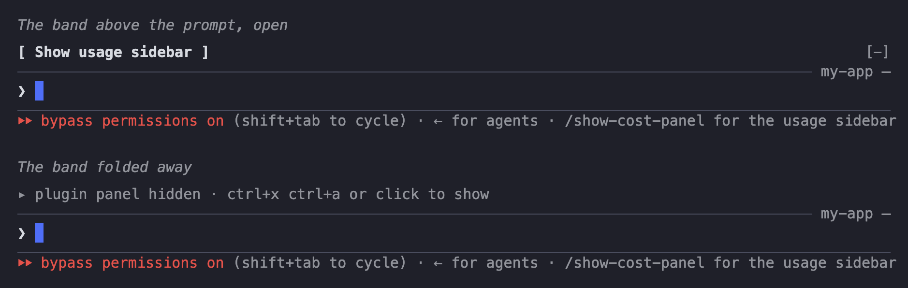

<sub>Illustration: Claude Code draws the band, the prompt and the line under it; this is a copy of how they look.</sub>

The numbers are the panel's own, not a second implementation: for each session the mod starts `ccusage-panel.sh` without a terminal (`PANEL_HEADLESS=1`, via `~/.local/bin/ccusage-panel-mod-start`), and it runs its usual two refresh tiers and writes what it would have drawn, as numbers, to `~/.cache/ccusage-panel-cache/mod/<session id>.json`. The mod reads that file every 5 seconds. When the session ends the mod stops saying it is there, and the headless panel exits by itself 90 seconds later. The floating alerts over Ghostty still come from it.

While the mod is installed the Ghostty split below stands aside. Set `CLAUDE_PANEL_SPLIT=true` in the options file to have the split as well, or `CLAUDE_PANEL_MOD=no bash claude-panel-setup.sh` to install without the mod.

## Reading the sidebar

Every dollar figure is tokens counted on this Mac, priced at pay-as-you-go API rates. On a Pro or Max plan that is a measure of use, not a bill. The top line of the sidebar reads `live · 14:19`, the time the figures were last written; it turns to a red `stopped 4m ago` when they are more than 3 minutes old.

Colours mean the same thing everywhere: green is normal, yellow is raised, red is high, purple is far out of range, and cyan marks "this one" (this session, this hour, today, this project).

### Session

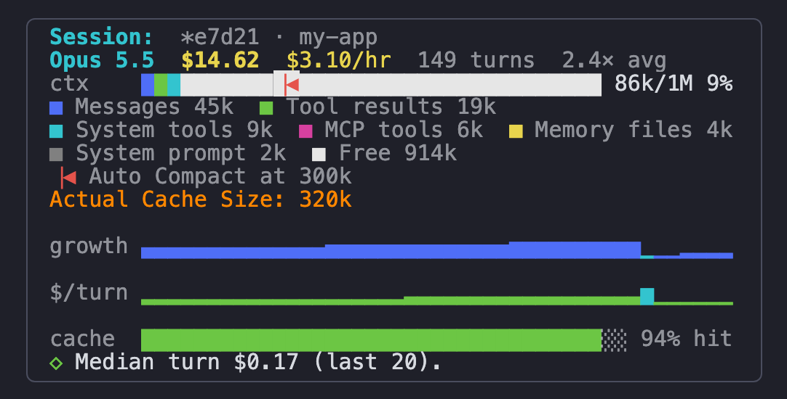

| On screen | What it is |
|---|---|
| `*e7d21 · my-app` | The last five characters of the session id, and the folder it runs in. |
| `Opus 5.5` | The model of the latest turn, read from the transcript. |
| `$14.62` | What this session has cost so far, coloured against your 7-day average session. |
| `$3.10/hr` | This session's burn rate. |
| `149 turns` | Replies from the model so far. |
| `2.4× avg` | This session against your 7-day average session, shown once it has reached half of it. |
| `ctx` bar and `86k/1M 9%` | How full the context is, against the model's whole window. With Claude Burst this is the context Burst really sends, and a thin red line with an arrow (`▕◀`) on the bar shows where Burst compacts (`Auto Compact at 300k` underneath), asked from Burst for the folder the session runs in (`GetAutoCompactionThreshold`), and marked `(Intelligent)` when Burst's Intelligent Compaction Mode chose it for that repository; that limit is your setting, not the room there is. The label turns yellow as it nears the line (at Burst's warning level) and red past it. Without Burst, see [below](#the-context-bar-without-claude-burst). |
| The coloured parts and their key | With Burst, what the context is made of, largest first: messages, tool results, system tools, MCP tools, memory files (CLAUDE.md and the like), the system prompt. Light grey is `Free`: the room left in the window. What is used takes its true share of the bar, so a part smaller than one cell is in the key but not on the bar. |
| `Uncompacted Size: 320k` | Claude Code's own history, which Burst's compaction never shrinks. The gap to the `ctx` figure is what Burst saves on every turn. Always shown. Green: nothing compacted yet, it is the `ctx` figure (within a tenth). Yellow: Burst sends a summary and Claude Code holds more than a tenth above it. Red: it holds 300k or more beside a summary, so opening the session again (`--resume`, `--continue`) compacts Claude Code's own copy with Burst's summary, in the background and without a summary request; with **Hand Burst's summary to Claude Code** turned off on Burst's dashboard it stays yellow. |
| `growth` | Context size, one bar per turn, oldest on the left. Blue, then yellow past 40% of the model's window and red past 70%. A cyan bar is a turn where the context fell to under 60% of the turn before: a compaction. |
| `$/turn` | Cost, one bar per turn. Yellow is over 2× the median turn, red over 4×. The cyan bar is the turn after a compaction (the same turn as the cyan drop in `growth`): it wrote the smaller context to the cache once, so it costs more by design and is never shown as a warning or reported as a costly turn. |
| Lines starting `↗ ◇ ▲ ◴ $ !` | Insights, at most three, only when there is something to say: how many turns until Burst compacts (or, without Burst, until the context turns amber) at the current growth, the median turn, a turn that cost over 4× the median, a session over 3× your average, a cache hit rate under 85%. `◴` is a turn made dear by a pause: it came more than five minutes after the one before, read under half its input from the cache (the cache had expired) and cost at least twice the median. It reads `Turn 212 came after a 26m pause and read 4% from cache: $0.90 against a $0.05 median.` |
| A line starting `▤` | With Claude Burst, one more: it names the part that is half or more of a context of 100k and up, e.g. `Tool results are 65% of the context sent.` |

#### A limit Burst learned, and a history worth compacting

<table>
<tr>
<td valign="top">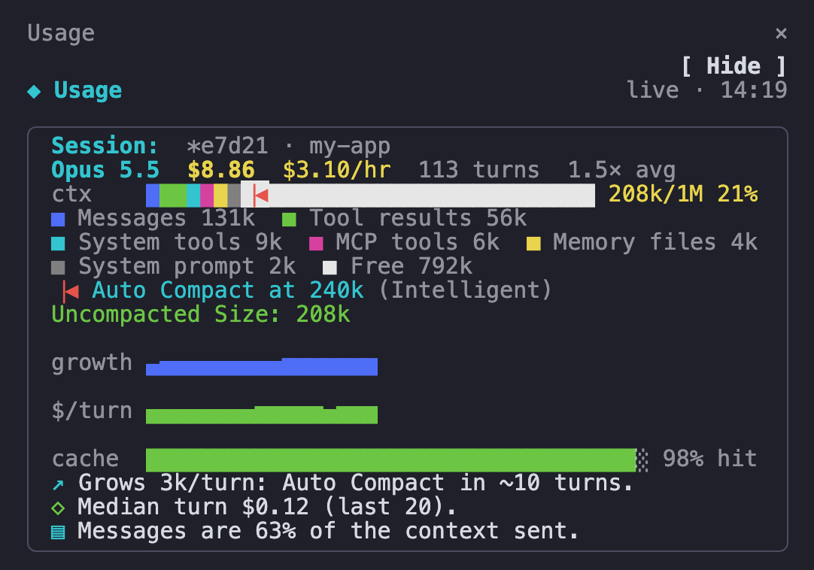</td>
<td valign="top">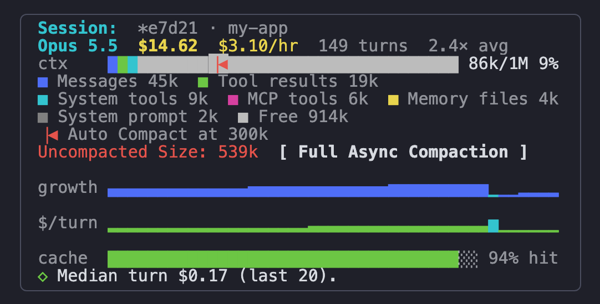</td>
</tr>
<tr>
<td align="center"><sub><code>(Intelligent)</code>: Burst chose this limit for the repository</sub></td>
<td align="center"><sub><b>Full Async Compaction</b>, from half the window held</sub></td>
</tr>
</table>

**Full Async Compaction** is beside `Uncompacted Size` once Claude Code holds half the model's window or more (500k of 1M). It runs Claude Burst's `/compact-async-full`: Claude Code's own history is replaced with the summary Burst already wrote, with no summary request and no pause, so `Uncompacted Size` comes down to what Burst sends. It is Burst's command, from its `burst-session` mod: where Burst holds no summary of the session yet, or its hand-off is turned off on the dashboard, Burst says so and nothing is compacted.

#### The context bar without Claude Burst

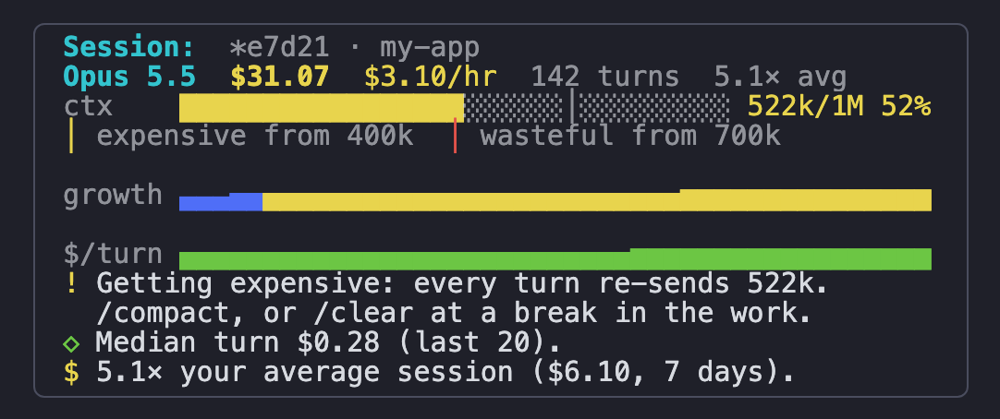

Nothing compacts for you, so the bar is a traffic light on the transcript's own context, and it tells you when to act.

| Context, as a share of the model's window | On a 1M window | Colour | What the card says |
|---|---|---|---|
| Under 40% | under 400k | Green | Nothing, or `Grows 3k/turn: amber (400k) in ~40 turns.` |
| 40% to 70% | 400k to 700k | Amber | `Getting expensive: every turn re-sends 522k. /compact, or /clear at a break in the work.` |
| Over 70% | over 700k | Red | `Wasteful: every turn re-sends 760k. /compact now, or /clear and start fresh.` |

- The window is the model's, read from the transcript, so on a 200k model the same lines sit at 80k and 140k.
- The two ticks on the bar are those lines, named underneath in tokens: `expensive from 400k`, `wasteful from 700k`.
- Why it matters: every turn sends the whole context again. Cached, that is cheap per token but not free, and one pause that lets the cache expire re-bills all of it at full price.

### Turns

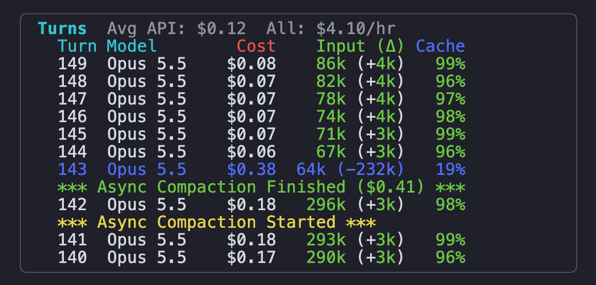

The last 12 turns of this session, newest first. Beside the heading, both across every session: `Avg API: $0.12` is today's average cost per turn (one turn is one API reply: today's turns and what they cost, read from today's transcripts), and `All: $4.10/hr` is the burn rate of the current 5h block.

| Column | What it is |
|---|---|
| `Turn` | The turn's number in this session. |
| `Model` | The model that answered, per turn, from the transcript. A `*` after it means the turn was served by Claude Burst's secondary provider; its cache and cost cells then show `--` and the gateway's own figure, or `?`. |
| `Input` | The whole context sent for that turn (input plus cache reads and writes). Coloured by how full the model's window is: yellow past 30%, red past 50%, purple past 70%. |
| `(Δ)` | What the turn added to the context. When the context shrank by a fifth or more, it is how much went, negative, and the whole row is blue: `64k (-232k)` is a compaction. When it rose by far more than the turn wrote, it is the rise, in yellow, over a `*** Replayed in full: 102k sent again ***` row: Claude Code sent its whole conversation again, which it does when Anthropic no longer holds the thread (after a pause, say). |
| `Cache` | The share of that turn's input read from the prompt cache. Green from 95%, red below, purple below 90%. A low figure straight after a compaction is expected. |
| `Cost` | That turn at the model's published rates, cache reads and writes included. `?` is a model with no known price. |

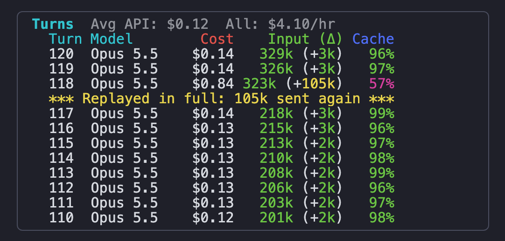

<sub>A turn that sent the whole conversation again.</sub>

A turn that added far more than the session's average, or one past 50% of the window, has its whole row coloured. The `*** Async Compaction ... ***` rows are Claude Burst's: see [Pauseless compaction](#pauseless-compaction-with-claude-burst).

### This Mac

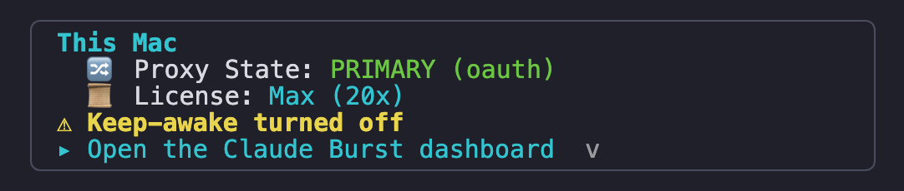

| On screen | What it is |
|---|---|
| `Proxy State` | With Claude Burst: where requests are going. `PRIMARY (oauth)` in green is your subscription; `SECONDARY (...)` in yellow is the overflow provider; `NOT IN USE` in red means Burst is installed but out of the path. Absent without Burst. |
| `License` | The plan Claude Code is signed in with, or `API key` when it is metered. |
| `⚠` rows | With Burst, each of its standing problems (yellow is a warning, red an error), and `⚡ Burst dashboard not answering` when it is down. |
| `[ Open Claude Burst dashboard ↗ ]` | A button: click it, or press `v` with the sidebar focused. |
| Red `!` rows | The panel's own errors (a `ccusage` call that failed, a model it has no price for), so a figure that is missing is explained. |

This card sits third so a problem is not under a screen of charts.

### Plan Utilisation

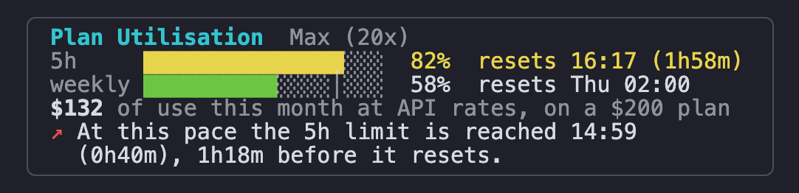

How close you are to your plan's limits. Anthropic states the figures itself, in headers on every reply; Claude Burst keeps the latest and the sidebar reads them from its dashboard every 15 seconds. They are Anthropic's numbers, not an estimate from token counts.

| On screen | What it is |
|---|---|
| `Max (20x)` | The plan Claude Code is signed in with. |
| `5h` bar, `82%  resets 16:17 (1h58m)` | The share of the 5-hour limit used, and when the window resets. Green, yellow from 80%, red from 95%. Any use at all fills at least one cell. In a narrow sidebar the bar moves to a row of its own under the figures, the full width of the card. |
| `weekly` bar, `58%  resets Thu 02:00` | The same for the 7-day limit. Any other window Anthropic reports (a per-model weekly limit, for one) gets a row of its own. |
| `$132 at API rates this month ($200 plan)` | What this month's use would have cost pay-as-you-go, beside the plan's flat price. Shown for Pro ($20), Max 5x ($100) and Max 20x ($200). |
| `What used the weekly limit` | The limit's reading shared out by project: the three projects that spent most since the window opened, and the rest as `other`, each with its part of the limit in points (a project at `31%` of a limit that reads `58%` used a little over half of what is gone). This session's project is in cyan and each other project has a colour of its own, the same in both blocks. One block for the 5-hour limit and one for the weekly. |
| Lines starting `↗ !` | `↗`: at the pace of this window so far, the limit is reached before it resets, with when and by how much. `!`: a limit is used up, and when it comes back. |

**What used a limit is an estimate.** Anthropic says how much of a limit is used, not what used it, and does not publish how it weighs tokens against a limit. The sidebar shares the reading out by each project's cost at API rates in Claude Burst's log over the same window, which is the nearest public measure. Read it as "which project", not as a figure to the point.

**A warning before you hit a limit.** When a limit passes 80%, and again at 95%, the mod raises a toast in the session: `🟡 Plan limit: 81% of the 5h limit used, resets 16:17 (1h58m)`, with a yellow mark at 80% and a red one (`🔴`) at 95%. Once per level and window, in every open session, so it is not repeated each minute.

**A warning when one day eats the week.** On the weekly limit, a day's fair share is a seventh (14%). When one day uses two days' worth (29%), one toast says so: `🟡 Plan pace: 30% of the weekly limit used today, over 2 days' share (29%). 60% used, resets Tue 04:00`. Once a day, from whichever session sees it first. The day starts at the first reading after midnight, so use before any session was open that day is not counted.

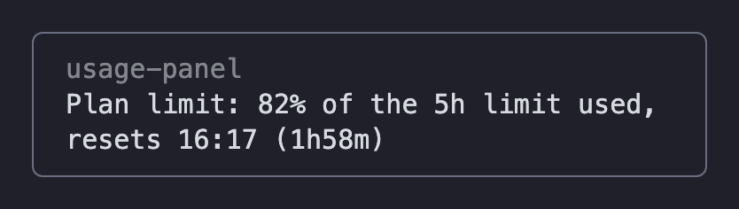

<sub>Claude Code draws the toast; this picture copies its look.</sub>

- The limit rows and the toast need Claude Burst: it is what sees Anthropic's replies. Without it the card shows the plan and the month's use only.
- There are two limits, 5 hours and 7 days. Anthropic reports no monthly one, so there is no monthly row or warning.
- A reading is from the last reply on this Mac, in any session, so it is as fresh as your last turn anywhere. The last one is kept, so a session that has not had a reply yet still shows it. A window that has reset is dropped until a reply reports the new one.
- On an API key there is no plan and no card.

### Pauseless Compaction

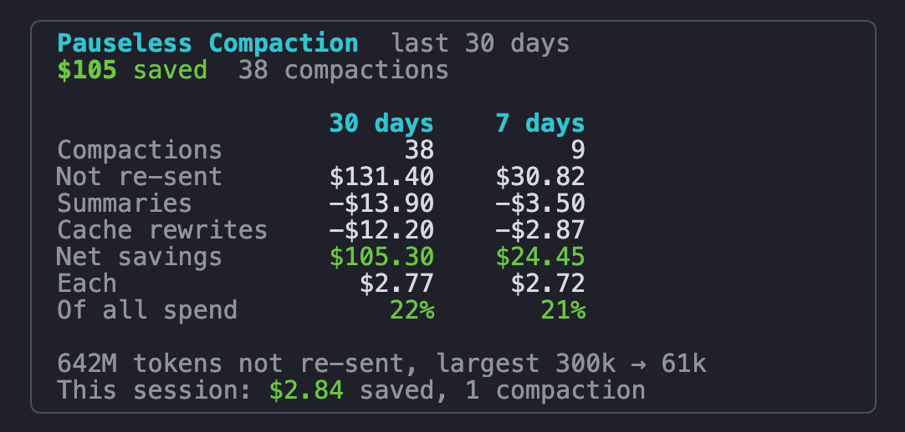

What Claude Burst's [pauseless compaction](#pauseless-compaction-with-claude-burst) has saved, across every session on this Mac. Shown only with Burst, once it has compacted something. The figures are Burst's own, read from its dashboard once a minute.

A table, not a chart: one column for Burst's window and, where that is longer than a week, one for the last 7 days (summed from Burst's daily figures). Burst's window is 30 days from 0.20.12; with an older Burst it is 7 days and the table has one column.

| On screen | What it is |
|---|---|
| `30 days`, `7 days` | The column headings: the window Burst keeps these figures over, and the last 7 days of it. |
| `$105 saved` | The net saving over the window: green when compaction has paid for itself, red (`lost`) when it has not yet. |
| `Compactions` | How many times Burst compacted. |
| `Not re-sent` | What the turns after each compaction would have cost with the full history still in the context. |
| `Summaries` | What the background calls that wrote the summaries cost. |
| `Cache rewrites` | Each compaction changes the context, so the next turn writes it to the cache once at the higher rate. |
| `Net savings` | Not re-sent, less the other two. Green, or red with a minus when it is a loss. |
| `Each` | Net savings per compaction. |
| `Of all spend` | Net savings as a share of everything spent over the same days, every provider, at API rates (from Burst's log). |
| `642M tokens not re-sent, largest 300k → 61k` | The same saving in tokens, and the biggest single compaction: the context before and after. In a narrow sidebar the largest has a row of its own. |
| `This session: $2.84 saved, 1 compaction` | This session's own share. `$0.40 lost so far` in yellow means its compaction has not paid for itself yet; it does over the next few turns. |

**Overflow to Secondary**, under it when requests have gone to the secondary, is the same table: requests, what they would have cost at Anthropic's price, what the secondary charged, net savings and its share of all spend.

### Today

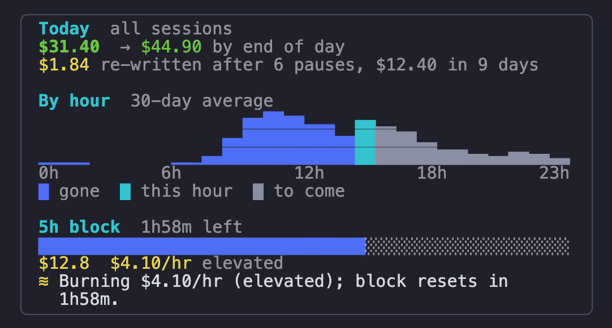

| On screen | What it is |
|---|---|
| `$31.40` | Spent today across all sessions on this Mac. |
| `→ $44.90 by end of day` | The forecast, from your own hour-by-hour pattern scaled by today's pace. It is not shown early in the day, before there is enough to go on. |
| `$1.84 re-written after 6 pauses, $12.40 in 9 days` | What pauses cost. The prompt cache expires after five minutes idle, and the turn after a longer pause writes the context to the cache again at about 25 times the price of reading it. This is that difference, for today's turns in every session, and over the days the panel has on file (30 at most, counted from the day this was installed). Not shown until there is a loss on file. |
| `By hour` | A typical day: your average spend in each hour over the last 30 days. Blue hours are gone, cyan is this hour, grey are still to come; the row under the chart says so. |
| `5h block  1h58m left` | The current 5-hour usage block and when it resets. The bar is how much of the block has passed. |
| `$12.8  $4.10/hr elevated` | Spent in this block, and its burn rate across all sessions, with the panel's word for it. |
| Lines starting `◔ ◴ ≋ ⇄` | Insights: a busy day (1.5× a typical day by this hour or more) or a quiet one (half or less), pauses that cost a tenth of the day or more (`◴`), and a raised burn rate. With Claude Burst, `⇄` says how many requests went to the secondary provider today, which one, and what they cost on top of the plan. |

### Sessions today

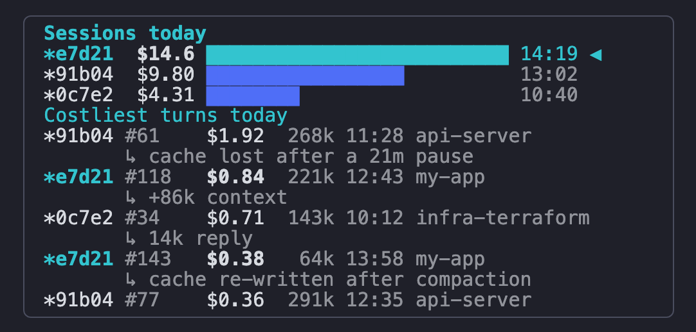

The five most expensive sessions today: the end of each session's id, its cost, a bar against the most expensive, and when it was last active. This session is in cyan with a `◀`; each other session has a colour of its own, the same on its rows under Costliest turns.

**Costliest turns today** is the five dearest single turns of the day, from whichever session they were in:

| Column | What it is |
|---|---|
| `*91b04` | The end of the session's id, in the session's colour from the chart above. This session's rows are in cyan. |
| `#61` | The turn's number in that session, the same number its turn table shows. |
| `$1.92` | What the turn cost. |
| `268k` | The context it sent. |
| `11:28` | When. |
| `api-server` | The folder that session runs in. |
| `↳ cache lost after a 21m pause` | Why the turn was dear, on a line under it. |

The reason is worked out from the turn and the one before it in its session:

| Reason | What happened |
|---|---|
| `cache lost after a 21m pause` | The turn came more than five minutes after the one before it and wrote again context that was already there: the cache had expired. |
| `cache missed: 197k written again` | The same with no pause: something early in the prompt changed (a model switch, an edited system prompt), so the cache did not match. |
| `cache re-written after compaction` | The context shrank and the shorter prompt was written to the cache. Expected, once per compaction. |
| `first turn: 38k written to cache` | A session's first turn has nothing to read from cache. |
| `+86k context` | The turn added that much: a large file read or tool result. |
| `14k reply` | A long reply. Output costs five times what input does. |

No line means nothing stood out: the turn was dear because the whole context is large. A session resumed from another repeats its turns in its own transcript; each is listed once. A session's newest 300 turns are read, and turns served by a secondary provider are left out, as they are from the session total.

### Last 30 days

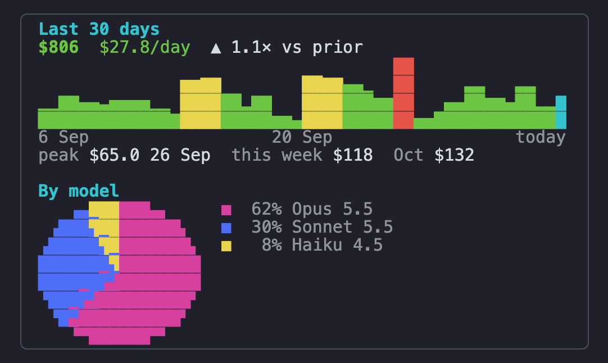

| On screen | What it is |
|---|---|
| `$806` | Spent in the last 30 days. |
| `$27.8/day` | The daily average. |
| `▲ 1.1× vs prior` | Against the 30 days before that. `▼` and green when it fell, yellow from 1.5×. |
| The bar chart | One bar per day. Green is ordinary, yellow is over 1.5× the daily average, red over 2×, cyan is today. |
| `peak $65.0 26 Sep` | The most expensive day. |
| `this week $118` / `Oct $132` | This week and this calendar month so far. |
| `By model` | Each model's share of the 30 days' spend, as a pie with its key beside it: clockwise from twelve o'clock, largest first. Five models are named; any more are one grey `Other` slice. A share too small for a cell is in the key but not on the pie. |

### Projects

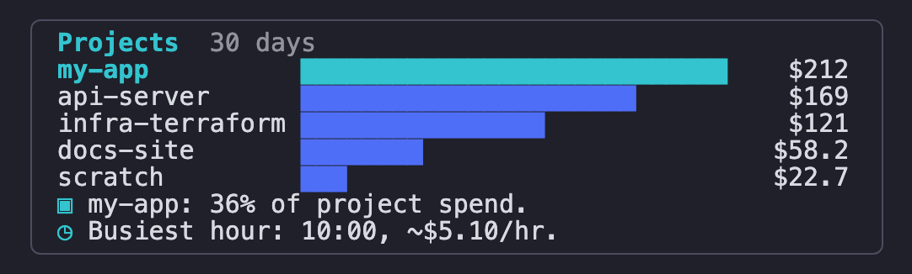

Spend by project folder over 30 days, largest first, each project in a colour of its own and this session's in cyan. Under it, two general insights, each shown only when something has changed (a line that is always there is not read):

- `▣ New top project: api-server is 46% of the last 7 days (my-app leads the 30).` The project that leads the last 7 days, with 30% of the spend or more, is not the one that leads the 30. Needs Claude Burst, whose log the 7 days are read from.
- `◷ Unusual hour: 23:00 averages $0.40/hr, against $5.10 at 10:00.` This session is working at an hour that averages under a tenth of your busiest one.

## Pauseless compaction, with Claude Burst

[Claude Burst](https://github.com/andrewbakercloudscale/claude-burst) is the companion to this panel: a local gateway between Claude Code and Anthropic. One of the things it does is **pauseless compaction**. Claude Code's own `/compact` stops the session while it summarises. Burst writes the summary in the background while you keep working and swaps it in on your next prompt, so the context shrinks without a pause ([how it works](https://github.com/andrewbakercloudscale/claude-burst/blob/main/docs/compaction.md)).

Burst does the compacting; this panel is where you see it. One compaction, in three steps:

<table>
<tr>
<td valign="top">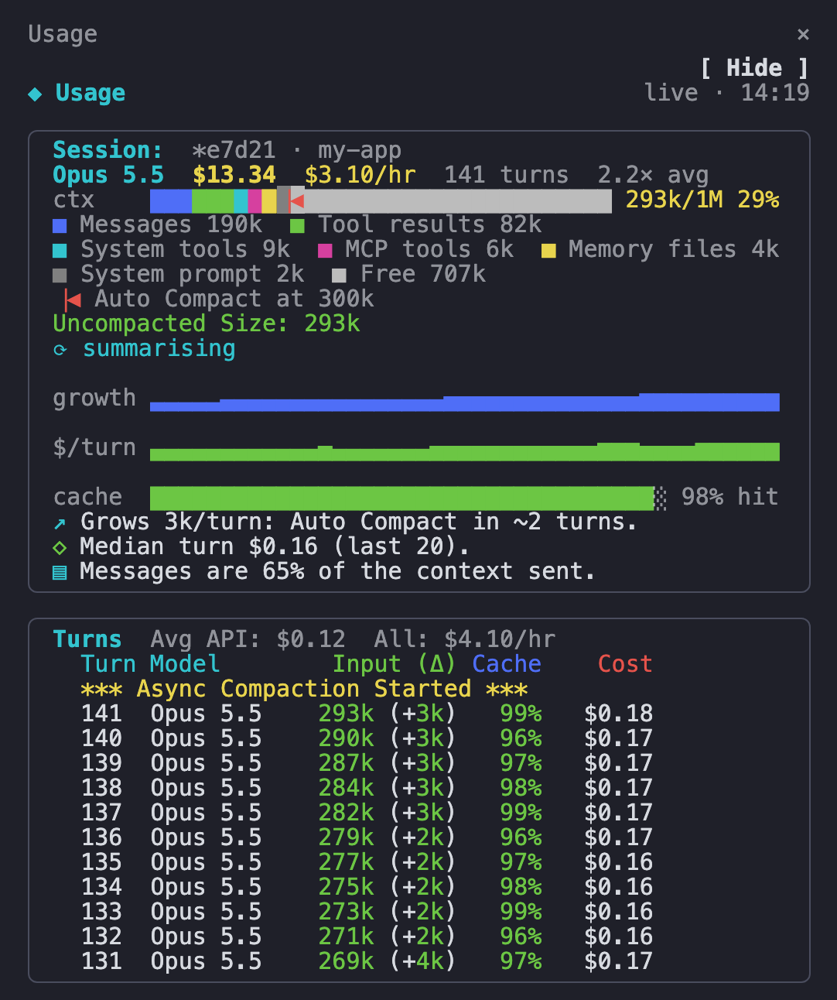</td>
<td valign="top">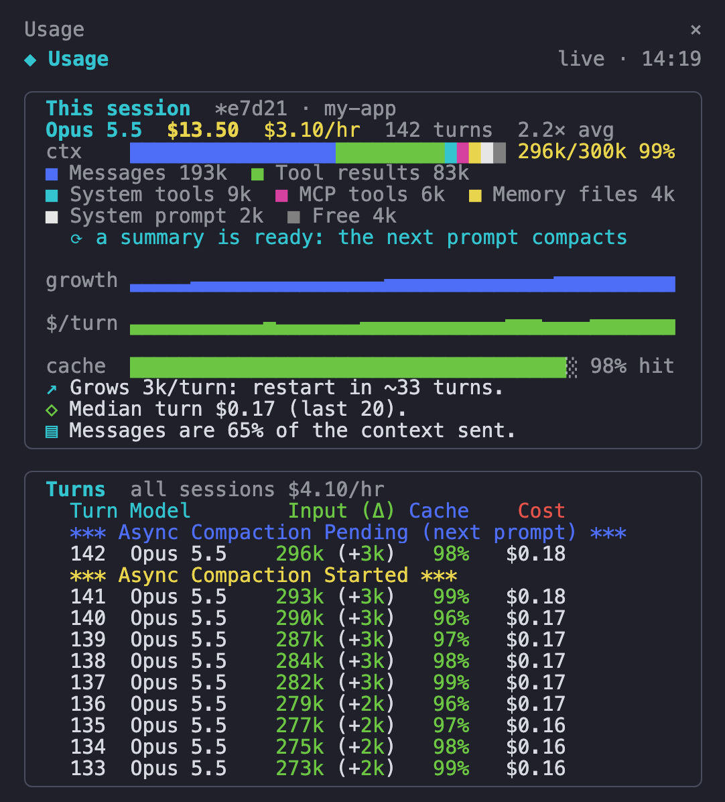</td>
<td valign="top">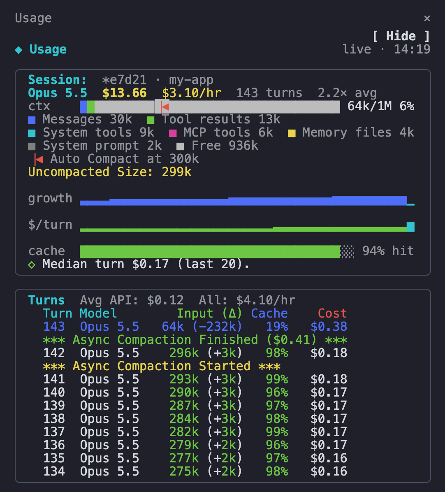</td>
</tr>
<tr>
<td valign="top"><sub><b>1. Started.</b> The context reaches Burst's limit (300k here, the red line on the bar). The ctx label is yellow, the session says <code>summarising</code>, and a yellow <code>Async Compaction Started</code> row sits above the turn it began beside. You keep working.</sub></td>
<td valign="top"><sub><b>2. Pending.</b> The summary is written and waits. The session says <code>a summary is ready: the next prompt compacts</code>, and the table has a blue <code>Pending (next prompt)</code> row. Turn 142 ran while the summary was being written.</sub></td>
<td valign="top"><sub><b>3. Finished.</b> The next prompt went out with the summary in place of the history: the turn's row in blue with <code>64k (-232k)</code>, a green <code>Finished</code> row with what the summary cost, and a cyan drop at the end of <code>growth</code>. Cache is 19% for that one turn, then recovers.</sub></td>
</tr>
</table>

What to look for:

- **The ctx bar is Burst's.** It is the context Burst sends after its own compaction, by part, against the limit it compacts at, read from Burst's dashboard every 5 seconds. Claude Code's own figure does not know a compaction happened, which is what the `Claude Code holds 299k` line is for.
- **The three marker rows** come from Burst's `~/.config/claude-burst/metrics.jsonl`. Each is drawn between the two turns it happened between. A Pending whose Finished landed before another turn ran is not drawn: the Finished says it all.
- **The blue row with a negative delta** is the first turn sent with the summary. That turn's cache hit is low and its cost is up, because the smaller context is written to the cache once. It is the expected price of the compaction, so it never colours the row as a spike.
- **Notices.** Where Burst's own `burst-session` mod is installed, it shows each step as a toast inside the session. Without it, on Ghostty, a small floating notice reads "Async Compaction In Progress", then "Async Compaction Finished" (`CLAUDE_PANEL_COMPACTION_OVERLAY`).

Without Burst none of this appears: the ctx bar is the panel's own gauge against the model's window, and the marker rows never show. Burst's installer offers to install this panel, and this panel finds Burst by itself; neither needs the other.

## The panel

`claude-panel-setup.sh` installs the panel itself, built on top of [`ccusage`](https://github.com/ryoppippi/ccusage). It is what computes every figure the sidebar draws, and on a Claude Code too old for mods (or with `CLAUDE_PANEL_SPLIT=true`) it draws them itself, as text in a Ghostty or tmux split:

- **Per-turn breakdown of the current session**: turn number, model, context size, context growth (Δ) since the last turn, cache hit %, and estimated cost per turn, read straight out of the session transcript and priced against Anthropic's published per-model rates (including cache read/write multipliers).
- **Live status line**: current session value, today's value, active-block burn rate, 7-day average session cost, 30-day value, and the current project folder. ("Value" because these are priced at pay-as-you-go API rates regardless of what plan you're actually on, see note below.)
- **Active block**: start/end time, value so far, burn rate ($/hr and tokens/min, color-coded green/yellow/red), and a projected total for the block.
- **Recent**: today's cost and tokens with a per-model breakdown (wrapped onto a second line when the pane is narrow), the last 3 days as dated costs (`3 days: 27th $75  28th $226  29th $141`), and this week and month. A model ccusage cannot price shows as `?`; when it is under 1% of the day's usage, today's total is still shown, marked `(+ unpriced)`, instead of being withheld.
- **Week / month totals.**
- **Top 5 sessions today** by cost.

Everything through the per-turn table is always shown in full; sections below it fill whatever pane height is left, so a short split never truncates the part you actually care about.

Also installs a **session-pin hook** (`claude-panel-session-hook.sh`, wired into Claude Code's `SessionStart` hook) that records which session is running in which directory, so the panel opens the right transcript instead of guessing, see "How it works" below.

Also installs a **cost-alert hook** (`claude-cost-alert-check.sh`, wired into Claude Code's `UserPromptSubmit` hook) that posts a warning *into the chat itself*, so it works over Remote Control too, not just locally, when the current session's cost crosses 2x (red) or 3x (purple) your 7-day average session cost, or when the panel failed to auto-launch for this window. There are three independent rules, a **per-session** one (this session vs your recent sessions), a **bad-day** one (today's *projected* total against a 2-sigma line, early enough to act on) and a **runaway-day** one (actual spend against a 3-sigma line). They read:

```
UserPromptSubmit says: 🟠 BAD DAY AHEAD: heading for $131.45 today, over your $127.29 2σ line ($71.20 spent so far)
UserPromptSubmit says: 🟥 DAILY SPEND: $412.10 today, over your $373.44 3σ limit (mean $114.77 over 13 days)
UserPromptSubmit says: 🔴 COST ALERT: $20.00 this session, 2.4x your $8.20 average
UserPromptSubmit says: 🟣 RUNAWAY COST: $61.00 this session, 7.4x your $8.20 average, consider wrapping up or starting a fresh session
```

On Ghostty it also fires a real macOS desktop notification (OSC 777) alongside the chat line; every other terminal gets a bell. And it **pushes to Telegram**, which is the only one of the three channels that will reach a phone you aren't currently looking at, credentials come from the shared `~/Desktop/github/.creds` (`TELEGRAM_BOT_TOKEN` / `TELEGRAM_CHAT_ID`), the same store the Pi watchdogs use. Setup turns the push on (`CLAUDE_PANEL_TELEGRAM=true` in `~/.config/claude-panel/options`) only when those credentials already exist, so a fresh machine gets no Telegram and no nagging about it; flip the option to change that, or set `CLAUDE_COST_ALERT_TELEGRAM=0`/`1` in the environment to override it; `bash check-panel-status.sh` reports whether it's configured and whether any sends have failed.

### Launching the split (without the mod)

- **Auto-launch on first use per window.** A `preexec` hook in `~/.zshrc` watches for the first `claude...` command typed in a terminal window and opens the panel automatically, you never have to remember to start it.
- **tmux-aware.** If you're inside a tmux session, the launcher uses tmux's own `split-window` instead of driving Ghostty via AppleScript, no Accessibility permission or keystroke simulation needed. This matters because tmux overrides `$TERM_PROGRAM` to `tmux` regardless of the outer terminal, so without this check the Ghostty path below would silently fail to detect Ghostty even when Ghostty is the real host.
- **Auto-resize** to 30% of the window width (a 70/30 split, `PANEL_WIDTH_PCT` to change it): via tmux's `split-window` inside tmux, or Ghostty's own default bindings (`cmd+ctrl+right` to resize, `cmd+opt+left` to put focus back on the claude pane), so nothing is added to `~/.config/ghostty/config`. While the launcher types, real keystrokes and mouse clicks are held back for a few seconds so neither can land in the wrong pane.
- **Verified, not assumed (Ghostty path).** The launcher drives Ghostty via `osascript`/System Events, retries up to 3 times, and confirms success by checking that a new panel *process* actually exists, not just that AppleScript returned exit code 0, which it will happily do even when nothing happened.
- **Logged.** Every launch attempt is logged with a shared run ID (`~/.cache/claude-panel-launch.log`) so a failed auto-launch is diagnosable instead of just silently missing.
- **Idempotent.** Safe to re-run any time: it overwrites the generated scripts with the latest version and skips any `.zshrc`/config block that's already present.
- **Finder Service aware.** If you launch Claude Code via a Finder Service / Automator workflow (`ghostty-claude-launcher`) rather than an interactive shell, the installer patches that script too, since the `preexec` hook never fires for it.

## How it works

The installer lays down a **panel script** (the thing that renders live stats in a loop) and a **launcher script** (the thing that opens a Ghostty split and starts the panel in it), plus a small `~/.zshrc` hook that fires the launcher automatically. A few decisions in there aren't obvious from the code alone:

- **Per-turn cost isn't available from Claude Code's own tooling, so the panel computes it itself.** `ccusage` only exposes session/day/block-level totals, not a per-message figure. The panel instead reads the raw session transcript directly (`~/.claude/projects/*/*.jsonl`) and prices every assistant turn from its token usage: input, output, cache read, and cache write tokens, each at Anthropic's published per-model rate (cache read at 0.1x the input rate, cache write at 1.25x/2x for 5-minute/1-hour cache). That's what makes the "per turn" table possible, it doesn't exist anywhere else.
- **The context-window math is fragile in a specific way, and the code works around it.** The panel needs the *real* session ID and model ID from the transcript, a placeholder ID silently returns a `$0.00` session cost instead of erroring, and an unset model ID makes `ccusage` assume an old 200k context window instead of Sonnet 5's actual 1M, which makes context usage read as `>100%`. Both failure modes are silent, which is exactly the kind of thing this project exists to prevent, so the panel derives both IDs from the transcript itself rather than trusting a default.
- **Rendering never trusts the pane's current size to stay put.** The panel is meant to sit in a resizable split, so every frame is measured against the *current* terminal width/height (`tput cols`/`tput lines`) rather than a fixed layout, and every printed line is padded with `\033[K` (clear-to-end-of-line) so a shorter new frame can't leave stale characters from a wider previous one ghosting through. It goes further still: the per-turn table is rendered as a "guaranteed" block that's never truncated, and only the sections below it (active block, today, trends, top sessions) compete for whatever pane height is left, so asking for the last 20 turns always means 20 turns, never "20 turns if there's room."
- **The AppleScript automation verifies itself instead of trusting its own exit code.** The launcher drives Ghostty via `osascript`/System Events to open a split, type the panel command, and resize the pane. AppleScript will report success (exit 0, no stderr) even when a stale frontmost check or an internal early `return` meant nothing actually happened, so the launcher doesn't believe it. It snapshots running panel processes before the attempt, snapshots them again after, and only calls it a success if a *new* process actually appeared. It retries up to 3 times and logs every attempt (with a shared run ID, so concurrent window opens don't interleave into an unreadable log) to `~/.cache/claude-panel-launch.log`.
- **The panel is told which session it is watching; it does not work it out.** A project directory holds every transcript that directory has ever produced, so "which of these is the conversation in the pane next to me" has no answer the panel can compute, two `claude` sessions open in one directory are indistinguishable by file. The answer is written down instead: `claude-panel-session-hook.sh` fires on Claude Code's `SessionStart` event and writes `<session-id>` where the panel can read it on every tick. Because the hook runs *inside* the session, it is authoritative rather than predictive, it covers `--resume`, `--continue`, GUI windows and IDE terminals, none of which the `~/.zshrc` `preexec` hook can pin in advance. The launcher writes the same thing for the id it chose, so the pin still works with hooks disabled.
- **The pin is addressed to a pane, not to a directory.** `~/.cache/claude-panel-pin/tty/<claude-tty>` holds the session id; `~/.cache/claude-panel-pin/pane/<panel-tty>` holds `<claude-tty>  <panel-pid>`, written by the launcher, the one process that ever sees both halves, because it runs in the claude pane's own shell and then watches the new panel appear. `~/.cache/claude-panel-pin/<project-dir>` still exists and is still read, but only by a panel with no pairing (started by hand, or through a path with no launcher).

  The directory key was wrong the moment a repo had two sessions open at once, which is the ordinary case here. Every launch overwrote the one pin every panel in that directory read, so all of them followed whichever session started last: on 2026-09-08 a panel adopted a second pane's session within a second of it opening and spent the night reporting that conversation's turns and cost as its own, and the next morning all three panels in that repo adopted a window that had been opened and never typed into, no transcript, so "no active Claude Code session found", permanently, against sessions live in the splits beside them. A pane hosts exactly one session at a time, so keying on the pane answers both. The panel refuses a pairing that names a different pid: terminal names are recycled, and without that check the next split to hold `ttys004` inherits the last one's claude.

- **A session with no pane writes no pin, and a pin is believed only while its session is alive.** The `SessionStart` hook fires for every session Claude Code starts, and most of them are nobody's pane: `claude --print` is how the standards-review sections run, how build scripts shell out to the CLI, how a hook spawns a one-shot. The hook now answers "which pane is this?" by walking up to the **first `claude` in its own ancestry** and taking that process's controlling terminal, none, and it writes neither pin and says so in the log. On the panel's side, a pin whose transcript has not been written to for `PANEL_PIN_DEAD` seconds (default: the same half hour that admits one) is released rather than held for the life of the pane, and a directory-keyed pin stands aside when it names something other than the one live *pane* session in that directory.

  All three halves of that failed together on 2026-09-14 in `wordpress-backup-restore-plugin`. A build ran two review sections at 16:14:30; both wrote the directory pin; the panel beside a 1080-turn Opus session adopted the second one three seconds later, and half an hour after that review had finished it was still reporting it as this pane's session, `Model: Sonnet 5`, `$0.30`, `9%` context, a three-row turn table, while the session it was watching ran on at `$38/hr` in the split beside it. The model line is what gave it away; every other figure was wrong in exactly the same way and looked entirely plausible. The tty pin was worse and nobody had noticed it at all: the old walk stopped at the first process with *any* terminal, which for a headless claude is not the claude but the interactive shell that started the build, so an ordinary build wrote a **pane** pin, the strongest channel there is, against the pane of the session that launched it.

- **Which pane a panel is in, and whether a session is over, are questions about processes, so they are asked of the process table.** Every pane in a Ghostty window descends from that window's own `ghostty … -e ghostty-claude-launcher <dir>` process: the panel through `login → zsh → ccusage-panel.sh`, its claude through `login → ghostty-claude-launcher → claude`. So a panel with no pairing file walks up to its window, looks for the one claude that descends from the same window, and takes its terminal, the same pairing the launcher writes, derived from the live process tree instead of from a note somebody managed to write down in time. Two claude panes in one window pairs nothing, and inside tmux the walk declines outright (every pane there descends from the one shared server, so it would answer "all of them"). And a pin is released only when its transcript has been quiet for `PANEL_PIN_DEAD` seconds **and** no process is running that session, `--session-id` on a live command line, or a tty pin whose pane still holds a claude.

  Both halves were indirect until 2026-09-15, and both were wrong that morning in this repo. The launcher writes its pairing from a `pgrep` that has to find the panel first, and when it misses there is no second try: two of the three panels open here had no pairing file at all and had spent their lives on the directory-keyed pin, which names a **repo**. Then the liveness test, transcript mtime, fired on a session that was merely idle. A transcript stops growing the moment a session stops being *typed into*, so at 10:29:13 both panels dropped a live session for having been quiet since 09:59, showed `no active Claude Code session found` for eighteen minutes beside the conversation they were reporting on, and at 10:47:04 adopted a session from a **different window**: the release added to prevent a misattribution caused one. `claude` pid 54674 was running throughout, in the pane whose panel had gone blank, and `ps` had said so all along, along with which window it shared with that panel.

  This replaced passing the session id on the panel's command line, which meant the *launcher typed it* into the new split as synthetic keystrokes. That is not a lossless channel. An observed pane ran with `9e435181h-888e-4f0c-811-3befb80226t3d` against a real id of `9e435181-888e-4f0c-81f1-3befb802263d`: an `h` and a `t` woven in from the real keyboard, an `f` lost, which names a transcript that will never exist, so it showed `Model: Unknown` and `no active Claude Code session found` for five hours while every account-wide figure beside it stayed correct. A file cannot be corrupted that way, and because it persists, a panel restarted mid-conversation reads the same answer it would have had at launch, the case the old "newest transcript born after the panel started" fallback structurally could not see.

- **The cost-alert hook is a second, independent instrumentation path.** `claude-cost-alert-check.sh` hooks into Claude Code's own `UserPromptSubmit` event and posts straight into the chat transcript via `systemMessage`: which is what makes it work over Remote Control, where a local desktop notification wouldn't reach you. It's throttled per session (state kept in `~/.cache/claude-cost-alert-state/<session_id>.json`) so it fires once per tier escalation rather than on every prompt, and it also surfaces launcher failures, so a broken panel doesn't fail silently either.

- **The message's shape is dictated by the renderer, which was measured rather than guessed.** Against Claude Code 2.1.266, `systemMessage` arrives as a `{"type":"system","subtype":"informational"}` event and *every line of it* is rendered with a literal `UserPromptSubmit says: ` prefix; markdown is not interpreted, but emoji are. So the alert is **one line per distinct alert**, never one alert wrapped over several, a three-line message repeats that 23-column prefix three times and pushes the figures off the right of a phone screen, and its emphasis is emoji and caps, with the severity word and the money first, because the front of the line is the part that reliably survives truncation. `tests/checks/AB_alert_message_shape.sh` holds that shape.

- **The bad-day rule fires on the *projection*, which is the only version of this alert you can act on.** A day total can only be judged once it has been spent, so an actual-spend rule is structurally a postmortem. The projection comes from your own hour-of-day spend pattern (`claude-hourly-buckets.json`), scaled by how today's pace compares with a typical day's, not a flat extrapolation of the live burn rate, which spikes 10x after one pricey turn and decays within minutes. Both the panel's "by EOD" figure and this alert now come from **one** file, `claude-day-projection.sh`: a panel drawing one number while an alert fires on another is drift with consequences, so both refuse to start without it rather than silently falling back.

- **The projection stands down below 25% of a typical day, measured in spend rather than clock.** Those hours are not equally productive: at 09:00 a normal day has barely started spending, so a $40 morning scales to a preposterous total and would flag a day that then goes quiet. And because only the *panel* writes the hourly buckets, a machine where the panel has never run has no projection at all, in which case the bad-day rule is not merely quiet, it is **off**, and `check-panel-status.sh` says so outright.

- **Two claims, not one**, so the early warning doesn't consume the later one: a day flagged at 14:00 that then genuinely blows past the 3-sigma line at 19:00 is two different pieces of news. When both would fire at once only the louder is sent, the actual limit sits above the projected one, so crossing it means the day was always going to be flagged.

- **The daily rules exist because the session rule structurally cannot see a bad day.** The session rule compares *one* session against the average session, so a day made of twenty ordinary sessions never trips it however much it totals, you can spend $150 across a day in silence. The daily rule is `mean + 3·sd` over the preceding days (sample sd, days with no activity simply absent rather than counted as zero), throttled once per calendar day and claimed with an atomic `mkdir` so that N open windows raise one alert rather than N.

- **The window does more work than the sigma multiplier, which is not obvious and cost a round of tuning to find.** sd here is about the size of the mean, so the limit is set largely by *which days are in view*. On a 30-day window mean+3σ was **$775.56** and exactly one day in that window cleared it, the window still carried a heavy fortnight from August. The same rule on a rolling **14 days** sits near $370 and does catch the outliers. Backtested over 24 days of real history: mean+3σ fired once, mean+2σ once, mean+1σ three times, 2× median five times, 1.5× median eight. The window is therefore 14 days, and `bash check-panel-status.sh` prints both live limits plus the sample behind them, a threshold nobody can see is one nobody can tell has stopped being reachable. Fewer than 7 days worked disables both rules outright and says so, rather than acting on an sd computed from three days.

- **A session is no longer counted in its own baseline.** It was, and that is self-defeating in exactly the case the alert exists for: a runaway session is a member of the set whose average it is measured against, so the further it runs the higher it drags the bar it must clear. Measured on a $42.13 session against three ~$8 ones, including it reported *"2.5x a $16.68 average"* where the honest answer is *5.1x an $8.20 average*, red instead of purple. With a per-tier throttle, a fire at the wrong tier can mean the real crossing is never reported at all.

- **The phone push fails silently by construction, so its failure paths are what the tests are about.** A broken chat line is visible in the chat and a broken bell is audible at the desk; a Telegram send that has quietly stopped working announces itself only by *not* telling you about a $200 session. So missing credentials are reported in the chat line, the channel still working, rather than swallowed, the send is detached and backgrounded (this hook sits on the interactive path under a 5s timeout, and an unreachable `api.telegram.org` must add zero seconds to a prompt submission), the message travels via `--data-urlencode text@file` so it never appears in `ps`, and curl's stderr is discarded rather than logged because it can echo a URL containing the bot token. `tests/checks/AC_alert_phone_push.sh` covers the missing-creds, opt-out and throttle paths.

- **A hook cannot raise a push notification *itself*, and the near-miss is worth naming.** `terminalSequence` reaches the terminal (a Ghostty desktop notification here) but is explicitly discarded in the web app and in cloud sessions, so it never reaches a phone. The tempting alternative, put "call the PushNotification tool" in `additionalContext`, which *is* delivered to the model, was tried and does not work: a model correctly treats an instruction arriving from hook output as untrusted and declines it, so that route looks wired up and silently does nothing. `additionalContext` is therefore kept purely descriptive. A genuine phone push has to leave the machine by a route the hook calls itself, which is what the Telegram send above is.
- **Everything is idempotent by construction.** Each installer checks for its own marker (a comment string in `~/.zshrc`, a `jq` query against `~/.claude/settings.json`, a grep against `~/.config/ghostty/config`) before appending anything, so re-running an installer after a script update never double-installs a hook or duplicates a keybind.

## Requirements

- Claude Code 2.1.287 or later for the sidebar (any terminal). Older versions get the split instead.
- macOS + [Ghostty](https://ghostty.org/) for the auto-split part, unless you run inside tmux, in which case tmux's own split is used instead and Ghostty isn't required. The panel script itself works in any terminal if you just run it manually.
- `jq`
- Node.js (for [`ccusage`](https://github.com/ryoppippi/ccusage), which setup installs with `npm install -g ccusage` when it is missing, and stops if it cannot) and Python 3
- Accessibility permission granted to Ghostty (macOS will prompt the first time the launcher tries to drive it via System Events), not needed for the tmux path

## Install

The lines at the [top of this page](#claude-code-cost-sidebar) clone the repo and run setup in one paste. From a checkout you already have:

```bash
bash claude-panel-setup.sh
```

Or via the wrapper script:

```bash
bash deploy.sh
```

**With Claude Burst.** [Claude Burst](https://github.com/andrewbakercloudscale/claude-burst), the companion gateway, is separate and optional. Its installer offers to install this panel too, and this panel needs no setting to find it. What the two show together is in [Pauseless compaction](#pauseless-compaction-with-claude-burst).

`deploy.sh` doesn't do anything the installer above doesn't already do on its own, there's no remote server for this repo, so "deploy" means re-running the installer to pick up the latest script changes on this machine. It's just a single command to re-run after pulling changes, mirroring the `deploy-*.sh` convention used elsewhere. Safe to re-run any time; the installer is idempotent. `bash deploy.sh claude` still works too, the argument existed while this repo also held the OpenCode panel, and quietly ignoring a word that used to mean something is the failure this project is about.

Then start a new Claude Code session: with the mod installed (Claude Code 2.1.287 or later) the sidebar opens by itself. Without it, open a **new** terminal window/tab (or `source ~/.zshrc`) and type a `claude...` command, and the panel opens automatically in a right-hand split.

You can also run the panel manually at any time, in any terminal:

```bash
~/.local/bin/ccusage-panel.sh [refresh_seconds] [turn_rows]
```

### Options

`~/.config/claude-panel/options`: created by the installer with everything `false`, never overwritten. Read at launch time, so an edit applies to the next session/panel without re-deploying. An environment variable of the same name overrides the file.

| Option | Effect when `true` |
|---|---|
| `CLAUDE_PANEL_REMOTE_CONTROL` | Interactive `claude` launches (the `~/.zshrc` wrapper and `ghostty-claude-launcher`) start with `--remote-control`, named after the folder (`claude-burst`, then `claude-burst 2` when a running session already has that name). Skipped for subcommands, a positional prompt, `-p`, `--help`/`--version`, or when you pass `--remote-control` yourself. |
| `CLAUDE_PANEL_BYPASS_PERMISSIONS` | Only `ghostty-claude-launcher`: `true` starts its sessions with `--dangerously-skip-permissions`, `false` without. With the key absent the launcher keeps whatever it did before setup (some launchers hard-code the flag). Typed `claude` sessions follow `permissions.defaultMode` in `~/.claude/settings.json` instead; Claude Burst's dashboard sets both from one checkbox. |
| `CLAUDE_PANEL_SPLIT` | With the usage-panel mod installed, open the Ghostty split as well. Without the mod the split always opens. |
| `CLAUDE_PANEL_CAFFEINATE` | Sessions started from the Finder launcher or by typing `claude` run under `caffeinate -i`, so the Mac does not sleep by itself while one is open (a split panel holds one too). `false` starts them as they are. |
| `CLAUDE_PANEL_KEEP_SCREEN_ON` | With the option above, `caffeinate -di`: the screen stays on as well, so it never locks while a session is open. Uses more battery. |
| `CLAUDE_PANEL_LOADING_OVERLAY` | Default `true`. While the launcher opens the panel split, focus is on the new split and typing is blocked for a few seconds. A small floating notice ("Loading usage panel... wait to type") sits over the top of the Ghostty window and turns to "Ready: start typing" the moment focus is back on the claude pane. It never takes focus, ignores the mouse, and closes itself after 10s at most. Set `false` to turn it off. Built by the installer as `~/.local/bin/claude-panel-overlay` (needs clang). |
| `CLAUDE_PANEL_COMPACTION_OVERLAY` | Default `true`. With Claude Burst, while it summarises this session in the background (pauseless compaction), the same floating notice reads "Async Compaction In Progress" and turns to "Async Compaction Finished" when the summary is done. It shows only while Ghostty is the app in front, never takes focus, and closes itself after 10 minutes at most. Where Claude Burst's mod shows compaction as toasts inside the session, the toasts are the notice and this one is not shown. Set `false` to turn it off. |
| `CLAUDE_PANEL_CLOSE_BUTTON` | Default `true`. An `[X]` in the panel's top-right corner closes it with a click; in the split the launcher opened, the split closes too (run by hand, it exits back to the prompt). With Claude Burst installed, a `[View]` button at the end of the Proxy State line opens Burst's dashboard (its `admin_listen`, `127.0.0.1:7788` by default). It works through terminal mouse reporting, so while it is on a plain drag in the panel no longer selects text: hold Shift to select. Set `false` for no button and normal selection. |

### Refresh tiers

The panel redraws on two clocks, and **each section header states its
own rate** so you can always see how old the number under it can be:

| Section | Default rate | Argument |
|---|---|---|
| `This Session` (per-turn table + burn rate) | 10s | `refresh_seconds` (arg 1) |
| Header summary, `Recent`, `Top Sessions Today` | 2m | `SLOW_REFRESH` env var |

The split exists because the two tiers cost wildly different amounts. The
per-turn table reads one transcript file and is cached on that file's own
mtime+size, so an idle pane re-renders it for free, it can afford to be
near-live. Everything else is built from `ccusage` reports, and every
`ccusage` invocation reparses the whole transcript corpus (hundreds of MB,
~0.3-1s of CPU each); at a single 10s tier an actively-used pane was paying
several of those *every ten seconds*, which is what made the fans spin.

```bash
# near-live turns, hourly summary
SLOW_REFRESH=3600 ~/.local/bin/ccusage-panel.sh 5 12

# everything slow, for a background monitor
SLOW_REFRESH=600 ~/.local/bin/ccusage-panel.sh 30 12
```

Both tiers sit behind a corpus-change gate: if nothing has been written under
`~/.claude/projects` since a cached answer was computed, that answer cannot
have changed, so the slow tier costs nothing at all on an idle pane no matter
how often it comes round. The block countdown and `$/hr` denominator are
derived locally from the block's own start/end timestamps, so they keep
moving between fetches without one.

## Uninstall

The one paste at the [top of this page](#claude-code-cost-sidebar) does it without a checkout. To see what it would change first, without changing anything:

```bash
curl -fsSL https://raw.githubusercontent.com/andrewbakercloudscale/claude-code-cost-sidebar/main/claude-panel-uninstall.sh | bash -s -- --dry-run
```

From a checkout:

```bash
bash claude-panel-uninstall.sh --dry-run   # list what would change
bash claude-panel-uninstall.sh             # remove it
```

It removes exactly what `claude-panel-setup.sh` installed: the usage-panel mod, the scripts and helpers in `~/.local/bin`, the autolaunch block in `~/.zshrc`, the panel's two hooks in `~/.claude/settings.json`, its patch to `~/.local/bin/ghostty-claude-launcher`, `~/.config/claude-panel` and the panel's caches and logs. Everything else in those files is left as it was, and each edited file is backed up beside itself first (`*.bak-ccusage-uninstall-<time>`). A block or launcher that has been hand-edited is left alone with a warning. The Ghostty `resize_split` keybinds stay (they are harmless and may predate the panel).

- **Remote Control:** the launcher's `--remote-control` option belongs to the panel's patch, so uninstalling removes it. Add `--remote-control` to the launcher yourself if you still want it.
- Panels already open keep running until their split is closed.
- Running it again is safe: it reports that nothing is installed.

## FAQ

- **Sonnet 5 (and Fable 5) burns through tokens much faster than Sonnet 4.6 did on the same kind of task, is there a way to cap it back to a 200k context window?** Yes. Set `CLAUDE_CODE_DISABLE_1M_CONTEXT=1` in your shell profile. Claude Code then treats Sonnet 5 / Fable 5 as having a 200k context window instead of their native 1M, removes the 1M variant from the model picker, and, this is the part that actually matters for cost, **auto-compaction kicks in at the 200k boundary**, the same discipline that was implicitly keeping 4.6's token usage in check. You don't need to switch models back to get that behavior. The panel shows which cap is currently in effect (`🧭 Context cap: 200k (forced via CLAUDE_CODE_DISABLE_1M_CONTEXT)` vs `1M (native)`) so it's visible at a glance rather than something you have to remember you set.
- **`/context` shows 200k even though I selected Sonnet 5: did it silently downgrade to 4.6?** Not necessarily. `/context` reports usage against whichever window is *currently active* for the session, and if `CLAUDE_CODE_DISABLE_1M_CONTEXT=1` is set (or you're behind an LLM gateway that defaults Sonnet 5 to 200k), you'll correctly see a 200k ceiling while genuinely running Sonnet 5. Check the per-turn `Model` column in the panel, it reads the real model ID out of the transcript for every turn, rather than inferring the model from the context-window size alone.
- **Does the generic `sonnet` alias always mean the latest Sonnet?** It's provider-dependent, not a bug: on the Anthropic API directly, `sonnet` resolves to the latest Sonnet (Sonnet 5 as of this writing). On Claude Platform via AWS it currently resolves to Sonnet 4.6; on Bedrock/Google Cloud/Microsoft Foundry it resolves to Sonnet 4.5. If you want a specific version regardless of provider, select it explicitly rather than relying on the bare alias.

## Design & investigation notes

Longer write-ups of the work behind the current behaviour. Read these before
changing the areas they cover, each one records a bug that was shipped, and
in two cases shipped twice.

| Document | Covers |
|---|---|
| [`SLOW-TIER-PLAN.md`](SLOW-TIER-PLAN.md) | This panel's refresh tiers, caching, TTL buckets, error surfacing, and every gate that failed silently on the way. The rollout log at §10 is the index. |
| [`LAUNCHER-TARGETING.md`](LAUNCHER-TARGETING.md) | **Which window gets the panel**, and why that is a hard question. The panel is not bound to the terminal process, the launcher types keystrokes into whatever window has focus. Read this before touching the frontmost check. |
| [`OPTIMIZATION-PLAN.md`](OPTIMIZATION-PLAN.md) | Superseded by `SLOW-TIER-PLAN.md`; kept as the record of an investigation whose conclusion was right and whose attribution was wrong. |

Both of the remaining documents were written while the OpenCode panel shared
this repo and refer to it in places. The equivalent pass for that panel is
[`OPENCODE-TIER-PLAN.md`](https://github.com/andrewbakercloudscale/opencode-cost-usage-panel/blob/main/OPENCODE-TIER-PLAN.md),
which moved with it.

## Troubleshooting

- **Panel never opens automatically**: check `~/.cache/claude-panel-launch.log`. If you're outside tmux, the most common cause is Ghostty missing Accessibility permission (System Settings → Privacy & Security → Accessibility). If you're inside tmux, confirm `tmux` is actually on `$PATH` for that shell (the log will say `TMUX is set but tmux binary not found` if not).
- **A new window opens with no panel, but only sometimes**: mostly fixed. The launcher now addresses its keystrokes to its own Ghostty *process* (`CGEventPostToPid`), so focus is irrelevant and the split cannot land in another window. That needs pyobjc's Quartz bindings, which are not on stock macOS: `pip3 install pyobjc-framework-Quartz` (or use a Homebrew python) enables it, and `~/.cache/claude-panel-launch.log` says which path each run took. Without them the launcher uses the older focus-dependent path, which refuses to type when it cannot positively identify the focused window, safe, but occasionally no panel. Recover by running `~/.local/bin/ccusage-panel.sh` in a split yourself. Background in [`LAUNCHER-TARGETING.md`](LAUNCHER-TARGETING.md)., the launcher can only split the window that has keyboard focus, and it refuses to type when it cannot positively identify that window as the one it was launched from. With several Ghostty instances running that identification can be ambiguous, and it skips rather than risk typing a shell command into whatever you are working in. The log line names every instance it saw and which one held focus. Recover by running `~/.local/bin/ccusage-panel.sh` in a split yourself. Background in [`LAUNCHER-TARGETING.md`](LAUNCHER-TARGETING.md).
- **Split opens but stays 50/50, or focus stays on the panel**: the launcher uses Ghostty's default `cmd+ctrl+right` (resize) and `cmd+opt+left` (focus left split). If `~/.config/ghostty/config` rebinds either, setup and `check-panel-status.sh` warn about it.
- **`Model: Unknown` and `no active Claude Code session found`, while every other figure is correct**: the panel has not been told which transcript is this pane's. Check `~/.cache/claude-panel-pin.log`: it records every pin adopted, ignored or abandoned, and every pane pairing learned. If the log shows neither a `paired:` line (the launcher's file) nor a `paired by window:` line (the panel's own walk up to its Ghostty window) for this panel, it is falling back to the directory-keyed pin, which is shared with every other session in the repo, so a second window opened there is enough to point it somewhere else; the log then also records every pin `releas`ed for going cold with nothing running it, every one `keep`ing its session because that session's process is alive, and every one `declin`ed in favour of the one live pane session in the directory, which is how an unpaired panel recovers on its own. Confirm `~/.claude/settings.json` has the `SessionStart` hook (`jq '.hooks.SessionStart' ~/.claude/settings.json`) and that `~/.cache/claude-panel-pin/tty/<your-claude-tty>` (`ps -o tty= -p $$` in the claude pane) names your current session id. Re-running `bash deploy.sh claude` installs the hook; it takes effect on the *next* session start, not the current one.
- **The month figure doesn't match the claude.ai usage page**: run `bash check-pricing.sh` (optionally with a start and end date). It re-prices this machine's transcripts at the published rates, per model and per UTC day, the same layout as the usage page. If one model is off by the same ratio every day, a rate is wrong. If whole days or models are missing, the usage page is counting spend this machine has no transcripts for (claude.ai chat, Claude Code on the web, another machine, or transcripts past `cleanupPeriodDays`).
- **Context % looks wrong / costs look off**: the panel infers the model ID from the live transcript to price each turn and size the context window correctly; if pricing changes on Anthropic's side, update the `PRICES` table inside `ccusage-panel.sh`.
- **"Value" figures don't match my actual bill**: expected on Pro/Max/Team plans. Every $ figure in the panel is `local token count × pay-as-you-go API rate`, not a real charge, it's a proxy for how much of the model you're using, not an invoice. Flat-rate subscribers will see numbers well above (or below) what they're actually billed.

## License

MIT

## Author

Written by [Andrew Baker](https://github.com/andrewbakercloudscale), Group Chief Information Officer at [Capitec Bank](https://www.capitecbank.co.za/). Blog: [andrewbaker.ninja](https://andrewbaker.ninja/). LinkedIn: [andrew-baker-ninja](https://www.linkedin.com/in/andrew-baker-ninja/).
